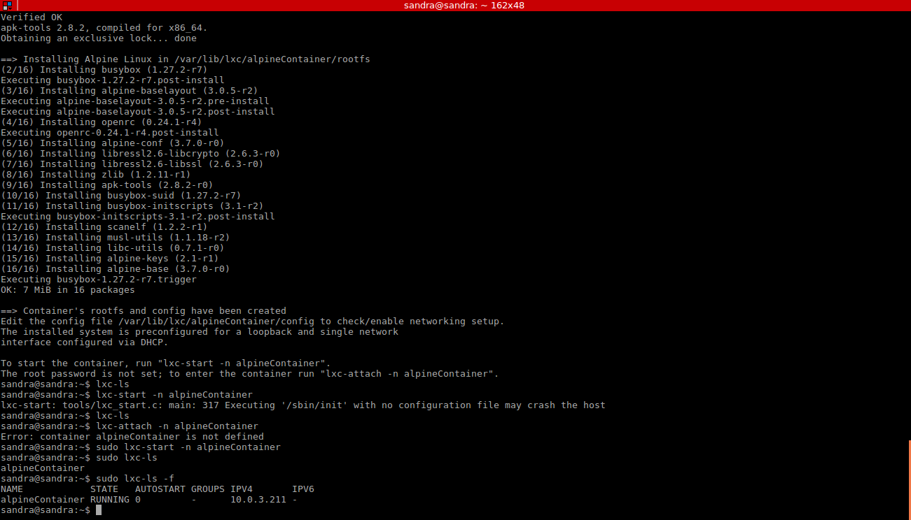
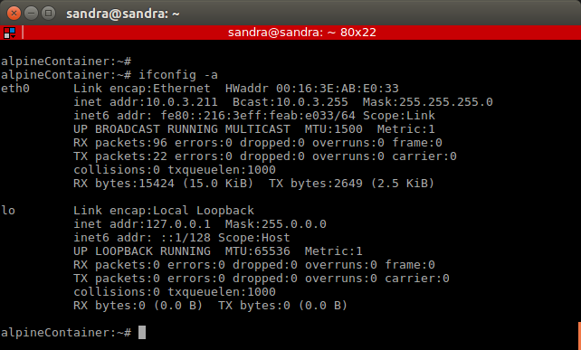
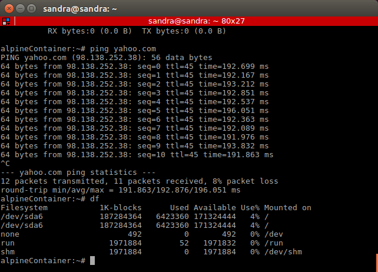

Cloud Computing Exercises Hito 5 
======

## Exercise 1

sudo apt-get install lxc 

lxc-checkconfig

lxc-info --version
 

## Exercise 2

sudo lxc-create -t alpine -n alpineContainer
 

sudo lxc-start -n alpineContainer

sudo lxc-ls -f

sudo lxc-console -n alpineContainer

Then we enter alpineContainer and asks for a login username and password. The first time I used root user but then I created a new user typing adduser named sandra with a new password. After that, we execute the following commands:
	
ifconfig -a
 

ping yahoo.com
df
 

To exit from the container’s console, press “Ctrl+a” followed by “q”. Now, we will be returned to host computer’s terminal.

To stop the container we execute the following:
sudo lxc-stop -n alpineContainer

We change to root user and we install lxc-webpanel

wget http://lxc-webpanel.github.io/tools/install.sh -O - |  bash

We access lxc-webpanel through localhost port 5000 through a web browser and once lwe are logged in we can manage the created containers. We enter using the following credentials:
username: admin
password: admin

## Exercise 3
## Exercise 4
## Exercise 5
## Exercise 6
## Exercise 7
## Exercise 8
## Exercise 9
## Exercise 10
## Exercise 11

