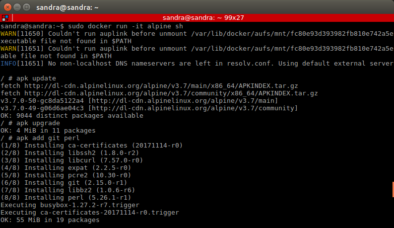

Cloud Computing Exercises Hito 5 
======

## Exercise 1

Instala LXC en tu versión de Linux favorita. Normalmente la versión en desarrollo, disponible tanto en GitHub como en el sitio web está bastante más avanzada; para evitar problemas sobre todo con las herramientas que vamos a ver más adelante, conviene que te instales la última versión y si es posible una igual o mayor a la 2.0.

```
sudo apt-get install lxc 

lxc-checkconfig
```


```
lxc-info --version
```

 

## Exercise 2

Instalar una distro tal como Alpine y conectarse a ella usando el nombre de usuario y clave que indicará en su creación.

```
sudo lxc-create -t alpine -n alpineContainer
```
 

```
sudo lxc-start -n alpineContainer

sudo lxc-ls -f
```


```
sudo lxc-console -n alpineContainer
```
Then we enter alpineContainer and asks for a login username and password. The first time I used root user but then I created a new user typing adduser named sandra with a new password. After that, we execute the following commands:

```
ifconfig -a
```	

 


```
ping yahoo.com
df
```

 

To exit from the container’s console, press “Ctrl+a” followed by “q”. Now, we will be returned to host computer’s terminal.

To stop the container we execute the following:
```
sudo lxc-stop -n alpineContainer
```

We change to root user and we install lxc-webpanel

```
wget http://lxc-webpanel.github.io/tools/install.sh -O - |  bash
```


We access lxc-webpanel through localhost port 5000 through a web browser and once lwe are logged in we can manage the created containers. We enter using the following credentials:
username: admin
password: admin


## Exercise 3

Provisionar un contenedor LXC usando Ansible o alguna otra herramienta de configuración que ya se haya usado.

I have spent many hours configuring it and doing different tests but it did not work.

## Exercise 4

Buscar alguna demo interesante de Docker y ejecutarla localmente, o en su defecto, ejecutar la imagen anterior y ver cómo funciona y los procesos que se llevan a cabo la primera vez que se ejecuta y las siguientes ocasiones.

The first time downloads the image and the next time we want to use the image it searches in the machine to see if it is already there and it executes it. 


## Exercise 5

Comparar el tamaño de las imágenes de diferentes sistemas operativos base, Fedora, CentOS y Alpine, por ejemplo.


## Exercise 6

Crear a partir del contenedor anterior una imagen persistente con commit.



```
sudo docker commit 160fdc9b49e2 update_alpine
```


## Exercise 7

Examinar la estructura de capas que se forma al crear imágenes nuevas a partir de contenedores que se hayan estado ejecutando.

```
sudo jq '.' /var/lib/docker/image/aufs/imagedb/content/sha256/f3c42e7faaecadb2cee5b9bf23b8687874e53042a8281f1fd80331d21c3d63a0
```


## Exercise 8
## Exercise 9
## Exercise 10
## Exercise 11

